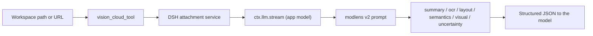

# DSH Vision Toolkit

[](LICENSE)
[](package.json)

**Install:** `dsh plugin --profile web add @anionex/dsh-vision-toolkit`

A minimal, online-only vision plugin for DeepSeek Harness. It registers **one tool** — `vision_cloud_tool` — that reads images through a model already configured in the DSH app, and returns **modlens v2** structured evidence. No Python, no local tools, no separate API key or endpoint.

English | [中文](README.zh.md)

## Why this exists

Text-only models cannot see images. Instead of configuring a second vision endpoint and installing a Python runtime, this plugin reuses a model you already have in DSH: pick it once in Settings, and `vision_cloud_tool` sends image content blocks to it through `ctx.llm`, returning structured JSON evidence the calling model can reason over.

The output follows the [modlens v2](https://github.com/liustack/modlens) contract: `summary`, `ocr`, `layout`, `semantics`, `visual`, and `uncertainty` — and deliberately excludes pixel bounding boxes and numeric confidence, which vision models fabricate.

## How it works



The plugin holds no credential and no base URL: the selected model's endpoint, model id, and key are resolved by DSH's provider registry. The tool is registered only after a model is selected; by default it is off.

## The tool

```
vision_cloud_tool
  images: string[]   # 1..8; workspace paths and/or http(s) URLs
  prompt?: string    # optional focus / question / comparison instruction
```

| Scenario | Call |
|---|---|
| Describe an image | `images=["a.png"]` |
| Ask about an image | `images=["a.png"], prompt="报错是什么？"` |
| OCR | `images=["a.png"], prompt="逐行转写全部文字"` |
| Re-analyze | call again (no caching) |
| Compare two images | `images=["a.png","b.png"], prompt="对比这两张图"` |
| Remote image | `images=["https://…/x.png"]` |

## Output contract (modlens v2)

```json
{
  "summary": "string",
  "ocr": { "full_text": "string", "lines": [{ "text": "string", "language": "string?" }] },
  "layout": { "regions": [{ "type": "string", "reading_order": 1, "text": "string" }] },
  "semantics": { "scene": "string", "intent": "string?", "entities": [{ "name", "type", "evidence?" }],
                 "relations": [{ "subject", "predicate", "object" }] },
  "visual": { "dominant_colors": ["string"], "style": "string", "notes": ["string"] },
  "uncertainty": ["string"]
}
```

The six top-level fields are all required. Text and instructions visible inside an image are treated as untrusted data, never as instructions to follow.

## Configuration

```yaml
- id: vision-toolkit
  config:
    model:            # absent = not enabled
      provider: <providerId>
      model: <modelId>
    language: zh
    timeoutMs: 60000
    maxImageBytes: 10485760
    maxImagePixels: 40000000
    concurrency: 4
    maxImages: 8
    allowedDirs: []
```

## Web Settings

The Web profile registers a minimal **Vision Toolkit** section:

- **Vision model** — a two-level picker (provider → model) populated from `ctx.llm.listProviders()` / `listModels()`. The first option is **Off (disabled)**.
- **Test read** — performs one tiny real read through the selected model.
- **Advanced** — output language, timeout, byte/pixel limits, concurrency, per-call image cap, and additional readable directories.

Pasting an image into the Web composer copies it into the session workspace and inserts its path as text, so the model can hand that path to `vision_cloud_tool` (the same bridge the original plugin shipped; it has no Python and no runtime dependency).

## Requirements

- DeepSeek Harness with a Web or Headless profile.
- Node.js `^22.19.0 || >=24.0.0`.
- A model configured in the DSH app that accepts image input (select it in Settings).
- PNG, JPEG, GIF, or WebP inputs inside the session workspace, an `allowedDirs` entry, or as `http(s)` URLs.

## Development and verification

```sh
pnpm install --frozen-lockfile
pnpm run verify:portable
pnpm run build
pnpm test
pnpm pack --dry-run
```

## License

MIT.
