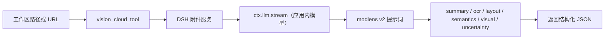

# DSH Vision Cloud

[](LICENSE)
[](package.json)

**安装：** `dsh plugin --profile web add dsh-vision-cloud`

一个极简、纯在线的 DeepSeek Harness 视觉插件。它只注册**一个工具** `vision_cloud_tool`：通过 DSH 应用内已配置的模型读取图片，并返回 **modlens v2** 结构化结果。零 Python、零本地工具、零独立 API Key 和地址。

中文 | [English](README.md)

## 为什么存在

纯文本模型无法看图。与其再配置一个视觉接口、再安装一套 Python 运行环境，本插件直接复用你在 DSH 里已经配置好的模型：在设置里选一次，`vision_cloud_tool` 就通过 `ctx.llm` 把图片发给它，返回结构化 JSON 证据供调用方模型推理。

输出遵循 [modlens v2](https://github.com/liustack/modlens) 规范：`summary`、`ocr`、`layout`、`semantics`、`visual`、`uncertainty`——并刻意去掉视觉模型会编造的像素框和置信度数值。

## 工作原理



插件不保存任何密钥或接口地址：所选模型的地址、模型名与密钥全部由 DSH 的 provider 注册表解析。工具只有在选择模型后才注册，默认关闭。

## 工具

```
vision_cloud_tool
  images: string[]   # 1..8；工作区图片路径和/或以 .png/.jpg/.jpeg/.gif/.webp 结尾的 http(s) 地址
  prompt?: string    # 可选：关注点 / 问题 / 对比指令
```

| 场景 | 调用 |
|---|---|
| 描述一张图 | `images=["a.png"]` |
| 针对图提问 | `images=["a.png"], prompt="报错是什么？"` |
| 文字识别 | `images=["a.png"], prompt="逐行转写全部文字"` |
| 重新分析 | 直接再次调用（无缓存） |
| 同时对比两张图 | `images=["a.png","b.png"], prompt="对比这两张图"` |
| 网络图片 | `images=["https://…/x.png"]` |

只接受真实的 PNG/JPEG/GIF/WebP 图片输入。视频、音频、文档以及非图片 URL（例如 API 地址或 HTML/JSON 页面）会在下载内容前被拒绝。默认情况下 http(s) 地址必须以支持的图片扩展名结尾，因此任意链接不会被真正请求；无扩展名的签名/动态 CDN 图片地址需要开启 `allowExtensionlessImageUrls: true`。

## 输出规范（modlens v2）

```json
{
  "summary": "string",
  "ocr": { "full_text": "string", "lines": [{ "text": "string", "language": "string?" }] },
  "layout": { "regions": [{ "type": "string", "reading_order": 1, "text": "string" }] },
  "semantics": { "scene": "string", "intent": "string?", "entities": [{ "name", "type", "evidence?" }],
                 "relations": [{ "subject", "predicate", "object" }] },
  "visual": { "dominant_colors": ["string"], "style": "string", "notes": ["string"] },
  "uncertainty": ["string"]
}
```

六个顶层字段全部必填。图内可见文字与指令一律视为不可信数据，绝不当作指令执行。

## 配置

```yaml
- id: vision-cloud
  config:
    model:            # 缺省 = 不开启
      provider: <providerId>
      model: <modelId>
    language: zh
    timeoutMs: 60000
    maxImageBytes: 10485760
    maxImagePixels: 40000000
    concurrency: 4
    maxImages: 8
    allowedDirs: []
    allowExtensionlessImageUrls: false
```

## Web 设置

Web 配置页会注册一个精简的「视觉云」小节：

- **视觉模型**——两级选择（服务商 → 模型），数据来自 `ctx.llm.listProviders()` / `listModels()`，第一项为「不开启（默认）」。
- **测试读取**——用所选模型做一次极小的真实读取。
- **高级设置**——结果语言、超时、字节/像素上限、并发、单次图片上限、额外可读目录。

把图片粘贴到 Web 输入框，会将其复制进会话工作区并插入路径文本，模型即可把该路径交给 `vision_cloud_tool`（沿用原插件的粘贴桥，无 Python、无运行环境依赖）。

## 环境要求

- 带有 Web 或 Headless profile 的 DeepSeek Harness。
- Node.js `^22.19.0 || >=24.0.0`。
- 一个在 DSH 应用中配置好、且支持图像输入的模型（在设置里选择）。
- PNG、JPEG、GIF 或 WebP 输入，位于会话工作区、`allowedDirs` 目录内，或为 `http(s)` 地址。

## 开发与验证

```sh
pnpm install --frozen-lockfile
pnpm run verify:portable
pnpm run build
pnpm test
pnpm pack --dry-run
```

## License

MIT.
